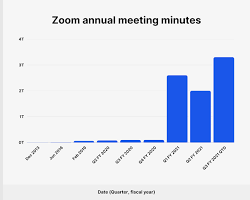

    

# Introduction

The COVID-19 pandemic has been a global crisis of unprecedented scale and impact, disrupting lives, economies, and societies around the world. It has been characterized by rapid spread, high case numbers, and significant mortality. The pandemic has had a profound impact on healthcare systems, economies, education, and social and mental well-being.

### Impact on Healthcare Systems

The COVID-19 pandemic has placed a severe strain on healthcare systems worldwide. Hospitals have been overwhelmed with patients, leading to shortages of beds, ventilators, and personal protective equipment (PPE). Healthcare workers have been under immense pressure, working long hours and facing the risk of infection. The pandemic has also led to delays in non-COVID-19 care, as hospitals have prioritized COVID-19 patients.

### Impact on Economies

The COVID-19 pandemic has caused a global economic recession, with GDPs shrinking in most countries. Businesses have been forced to close or reduce their operations, leading to job losses and increased unemployment. The pandemic has also disrupted supply chains and trade, further exacerbating the economic crisis.

### Impact on Education

Schools and universities have been closed for extended periods during the pandemic, disrupting education for students of all ages. This has had a significant impact on learning outcomes, particularly for disadvantaged students. Online learning has been offered as an alternative, but it has not been a perfect solution, as many students do not have access to reliable internet or the necessary technology.

### Impact on Social and Mental Well-being

The COVID-19 pandemic has had a profound impact on social and mental well-being. The isolation and social distancing measures required to control the spread of the virus have led to increased loneliness, anxiety, and depression. The pandemic has also exacerbated existing social inequalities, as people from lower-income households and minority groups have been more likely to experience job losses, food insecurity, and housing instability.

### Response to the Pandemic

In response to the pandemic, governments around the world have implemented a range of measures, including lockdowns, travel restrictions, mask mandates, and social distancing guidelines. These measures have had varying degrees of success in controlling the spread of the virus. Governments have also invested in vaccine development and distribution, with over 69% of the world's population now fully vaccinated.

The COVID-19 pandemic has been a harrowing experience for humanity, but it has also brought about a renewed sense of global cooperation and solidarity. The pandemic has shown the importance of strong public health systems, robust economic policies, and social cohesion in responding to global crises.

### Mobility

During state quarantines and lockdowns, people were forced to stay at home, leading to a sharp decline in mobility. This was reflected in a drop in traffic congestion, public transportation usage, and retail foot traffic. For example, data from Apple Mobility Trends showed a 95% decrease in visits to retail and recreation categories in New York City during the peak of the pandemic.

    

### Internet Consumption

In contrast, internet consumption skyrocketed during state quarantines. As people were spending more time at home, they turned to the internet for work, education, entertainment, and communication. This led to increased traffic on websites, social media platforms, and video streaming services. For instance, Zoom's daily user meetings increased from 10 million in December 2019 to 300 million in April 2020, demonstrating the surge in remote work and online communication during the pandemic.

    

The increase in internet usage also highlighted the importance of reliable internet connectivity. Many people found themselves struggling to access high-speed internet, which hindered their ability to work, learn, and stay connected with loved ones. This underscored the need for improved internet infrastructure and equitable access to broadband services.

The changes in mobility and internet consumption during the pandemic have had far-reaching consequences. They have reshaped how people work, learn, socialize, and engage with the world around them. As we continue to navigate the pandemic and its aftermath, understanding these changes will be crucial for designing future strategies for urban planning, digital infrastructure, and social support systems.