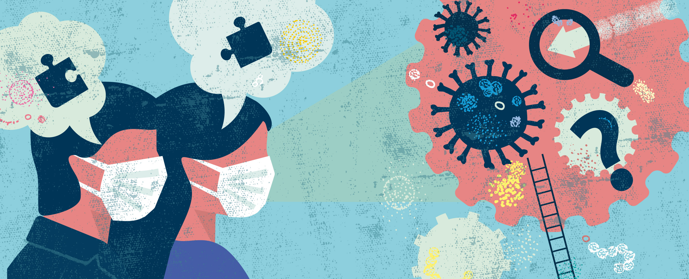

# Context

    

Remember the beginning of 2020, Covid spread like an unprecedent wildfire. The disease was not unkwnon, not understood
and scary. Most of the countries decided to lockdown to stop the spread and protect their populations. This resulted in
major and global changepoints in mobility :

ADD PLOTS ABOUT THE MOBILITY

This time at home was ideal for cooking, watching cat videos (or play with your cats) and spending time on the internet.
Interestingly, the global internet traffic followed the mobility evolutions:

ADD PLOT AND CORRELATION THERE

Main area of searched topics has been studied, you can have a look to : .. . But internet traffic during covid time was
not only made of cooking recipes and cats, it also was a proper time for fake news propagation, or as
the [WHO](https://www.who.int/health-topics/infodemic#tab=tab_1) calls it,
an infodemic. The ancestor of X, Twitter was one of the biggest place to propagate information, especially when
everything was changing as fast as the premise of the covid crisis. We all know that not all people have the same voice
on Twitter, few of them are considered to be the most influential individuals on the network. If you had to bet on of
person to be influential on Twitter, who would it be?

**Take a few seconds and answer to yourself, who would it be?**

I don't know who you got in mind, but for us, it has to be Donald Trump. Before he was evicted from the network, he was
one of the most followed account (source?). If you don't remind his tweet's style, here is a refresher :

We all know Donald Trump has spread fake news, especially on Twitter, his favorite communication channel.

TO MERGE :
Donald Trump’s many tweets during the Covid pandemic spread like wildfire, probably making him one of the most
influential figures during the pandemic – but in the end, was he that influential? Will causal analyses of the effect of
Trump’s tweets on Wikipedia and Google Trends pageviews show that he was leading or following online trends? Our
goal is to study the impact an influential leader can have on information spread in a
crisis with a focus on fake news, as an overload of misleading or contradictory
statements (an infodemic, as [WHO](https://www.who.int/health-topics/infodemic#tab=tab_1) calls it) are known to have a
detrimental impact on crisis
management. 
To provide a more comprehensive insight into Trump’s actual influence
on online information spread, we would then like to compare it with that of other
factors such as mobility restrictions or key milestones (e.g. first Covid death). 

### Trump the Trend Maker or Trump the Follower, that is the question!

## Donald Trump's tweets

## Who is causing whom? Let's study Donald Trump's favorite fake news

## What's the impact of topics and sentiment in the spread

# Introduction

The COVID-19 pandemic has been a global crisis of unprecedented scale and impact, disrupting lives, economies, and
societies around the world. It has been characterized by rapid spread, high case numbers, and significant mortality. The
pandemic has had a profound impact on healthcare systems, economies, education, and social and mental well-being.

### Impact on Healthcare Systems

The COVID-19 pandemic has placed a severe strain on healthcare systems worldwide. Hospitals have been overwhelmed with
patients, leading to shortages of beds, ventilators, and personal protective equipment (PPE). Healthcare workers have
been under immense pressure, working long hours and facing the risk of infection. The pandemic has also led to delays in
non-COVID-19 care, as hospitals have prioritized COVID-19 patients.

### Impact on Economies

The COVID-19 pandemic has caused a global economic recession, with GDPs shrinking in most countries. Businesses have
been forced to close or reduce their operations, leading to job losses and increased unemployment. The pandemic has also
disrupted supply chains and trade, further exacerbating the economic crisis.

### Impact on Education

Schools and universities have been closed for extended periods during the pandemic, disrupting education for students of
all ages. This has had a significant impact on learning outcomes, particularly for disadvantaged students. Online
learning has been offered as an alternative, but it has not been a perfect solution, as many students do not have access
to reliable internet or the necessary technology.

### Impact on Social and Mental Well-being

The COVID-19 pandemic has had a profound impact on social and mental well-being. The isolation and social distancing
measures required to control the spread of the virus have led to increased loneliness, anxiety, and depression. The
pandemic has also exacerbated existing social inequalities, as people from lower-income households and minority groups
have been more likely to experience job losses, food insecurity, and housing instability.

### Response to the Pandemic

In response to the pandemic, governments around the world have implemented a range of measures, including lockdowns,
travel restrictions, mask mandates, and social distancing guidelines. These measures have had varying degrees of success
in controlling the spread of the virus. Governments have also invested in vaccine development and distribution, with
over 69% of the world's population now fully vaccinated.

The COVID-19 pandemic has been a harrowing experience for humanity, but it has also brought about a renewed sense of
global cooperation and solidarity. The pandemic has shown the importance of strong public health systems, robust
economic policies, and social cohesion in responding to global crises.

### Mobility

During state quarantines and lockdowns, people were forced to stay at home, leading to a sharp decline in mobility. This
was reflected in a drop in traffic congestion, public transportation usage, and retail foot traffic. For example, data
from Apple Mobility Trends showed a 95% decrease in visits to retail and recreation categories in New York City during
the peak of the pandemic.

    

### Internet Consumption

In contrast, internet consumption skyrocketed during state quarantines. As people were spending more time at home, they
turned to the internet for work, education, entertainment, and communication. This led to increased traffic on websites,
social media platforms, and video streaming services. For instance, Zoom's daily user meetings increased from 10 million
in December 2019 to 300 million in April 2020, demonstrating the surge in remote work and online communication during
the pandemic.

    

The increase in internet usage also highlighted the importance of reliable internet connectivity. Many people found
themselves struggling to access high-speed internet, which hindered their ability to work, learn, and stay connected
with loved ones. This underscored the need for improved internet infrastructure and equitable access to broadband
services.

The changes in mobility and internet consumption during the pandemic have had far-reaching consequences. They have
reshaped how people work, learn, socialize, and engage with the world around them. As we continue to navigate the
pandemic and its aftermath, understanding these changes will be crucial for designing future strategies for urban
planning, digital infrastructure, and social support systems.
