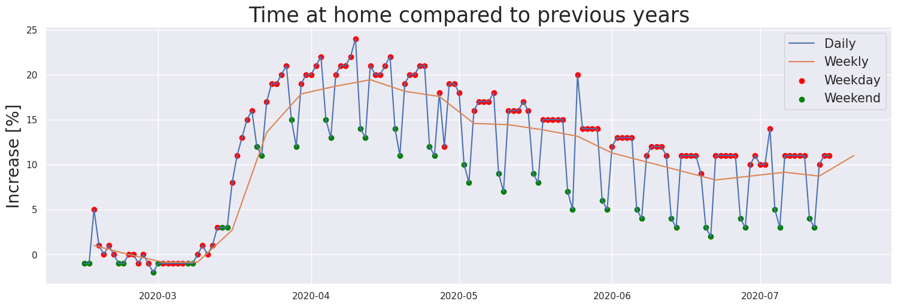
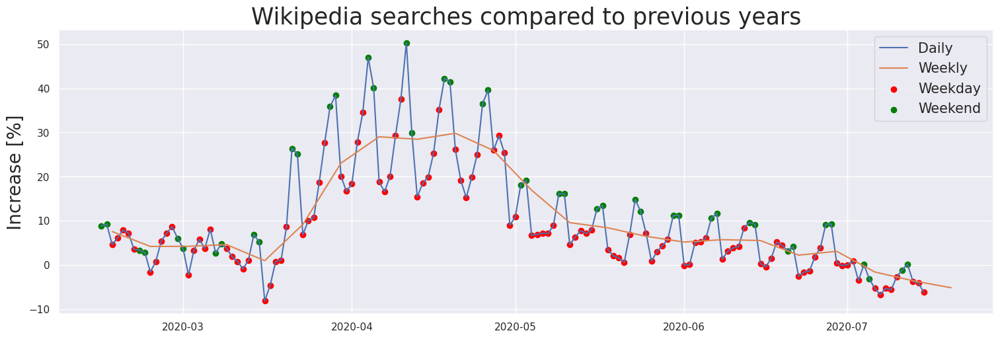
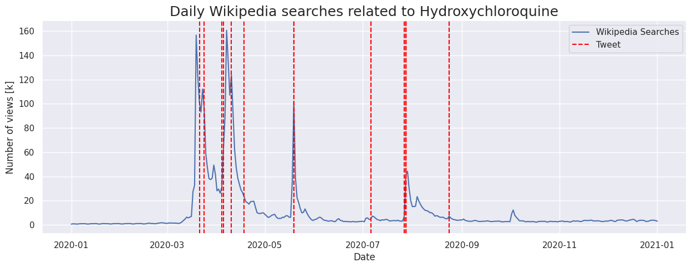
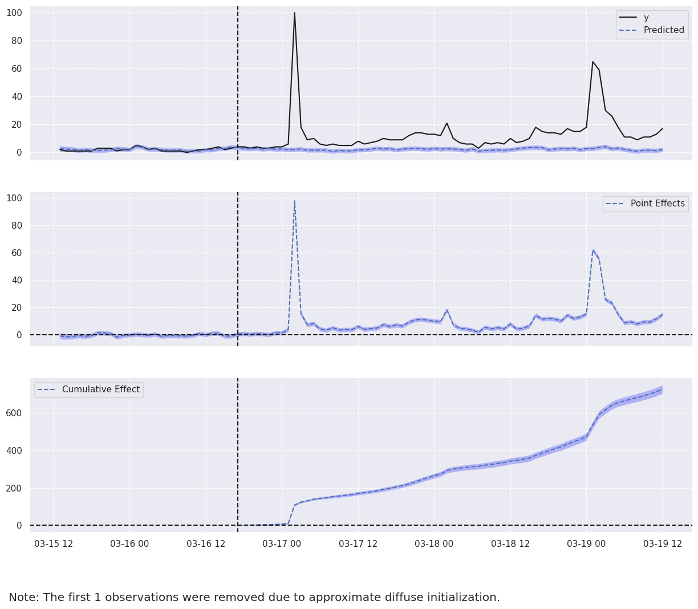
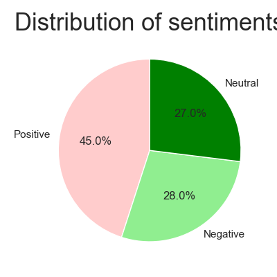
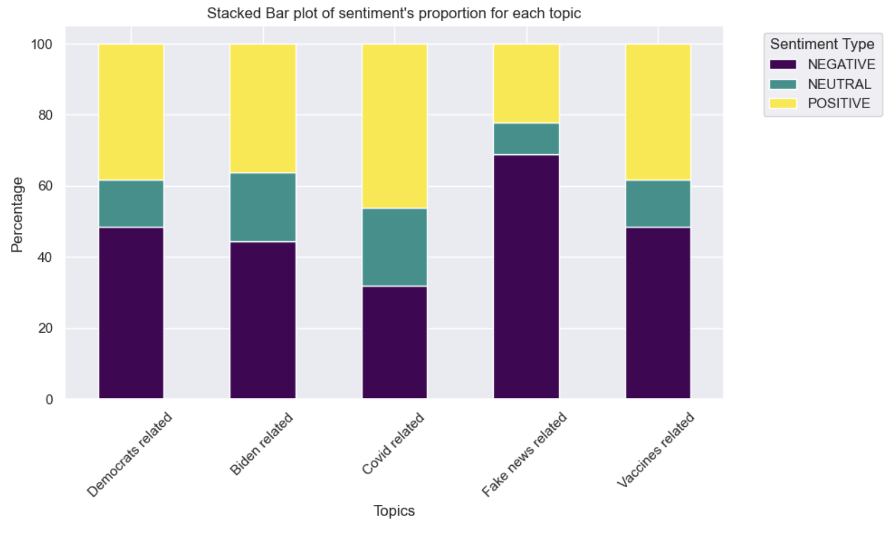
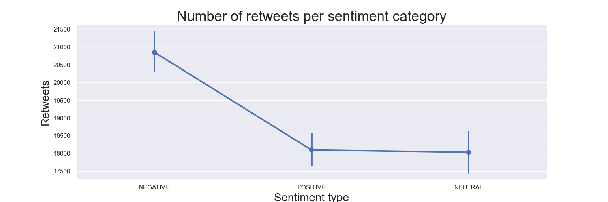
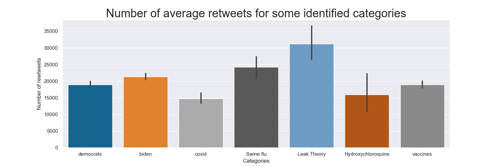
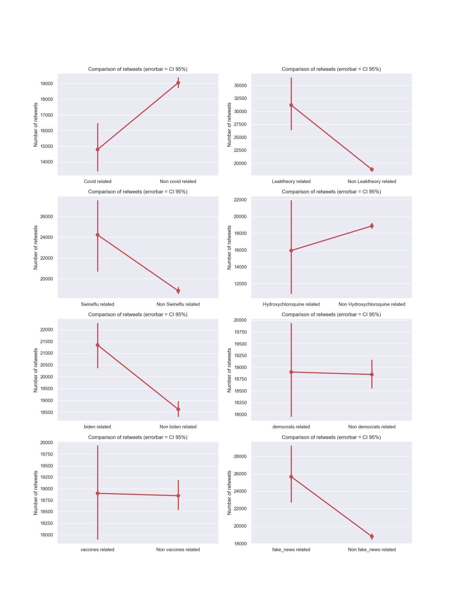

    

# Context

Remember the beginning of 2020, Covid spread like an unprecedent wildfire. The disease was unkwnon, not understood
and scary. Most of the countries decided to lockdown to stop the spread and protect their populations. This resulted in
major and global changepoints in mobility:

    

Two distinct patterns emerged, distinguishing between weekdays and weekends. 
On weekdays, a majority of businesses either had to close or transition to telecommuting. This impact persisted beyond the lockdown period, as indicated by the data. 
Conversely, weekends also experienced disruption, but this effect diminished to near pre-restriction levels after the restrictions were lifted.
We are particularly interested in studying this second part, as during the weekend, people were not working but had free time to engage in various activities.

This time at home was ideal for cooking, watching cat videos (or play with your cats) and spending time on the internet.
Interestingly, the global internet traffic followed the mobility evolutions:

    

Notably, while the time spent at home witnessed a more significant increase on weekdays, the surge in web searches, estimated by the number of wikipedia searches, was more pronounced during weekends. This is expected, considering that weekdays were still occupied by telecommuting activities.

A linear regression analysis supports this observation. When regressing the number of web searches against the time spent at home, the weekends exhibit a substantially higher coefficient of 2.52, in contrast to the coefficient of 0.84 observed during the week.

Main area of searched topics has been studied, you can have a look to : .. . But internet traffic during covid time was
not only made of cooking recipes and cats, it also was a proper time for fake news propagation, or as
the [WHO](https://www.who.int/health-topics/infodemic#tab=tab_1) calls it,
an infodemic. The ancestor of X, Twitter was one of the biggest place to propagate information, especially when
everything was changing as fast as the premise of the covid crisis. We all know that not all people have the same voice
on Twitter, few of them are considered to be the most influential individuals on the network. If you had to bet on of
person to be influential on Twitter, who would it be?

**Take a few seconds and answer to yourself, who would it be?**

I don't know who you got in mind, but for us, it has to be Donald Trump. Before he was evicted from the network, he was
one of the most followed account (source?). If you don't remind his tweet's style, here is a refresher :

    

We all know Donald Trump has spread fake news, especially on Twitter, his favorite communication channel.

TO MERGE :
Donald Trump’s many tweets during the Covid pandemic spread like wildfire, probably making him one of the most
influential figures during the pandemic – but in the end, was he that influential? Will causal analyses of the effect of
Trump’s tweets on Wikipedia and Google Trends pageviews show that he was leading or following online trends? Our
goal is to study the impact an influential leader can have on information spread in a
crisis with a focus on fake news, as an overload of misleading or contradictory
statements (an infodemic, as [WHO](https://www.who.int/health-topics/infodemic#tab=tab_1) calls it) are known to have a
detrimental impact on crisis
management.
To provide a more comprehensive insight into Trump’s actual influence
on online information spread, we would then like to compare it with that of other
factors such as mobility restrictions or key milestones (e.g. first Covid death).

### Trump the Trend Maker or Trump the Follower, that is the question!

## Who is causing whom? Let's study Donald Trump's favorite fake news

# Does Trump cause Online Trends?

One of our research questions is to find whether there is a causal relationship between Trump's tweets and the number
of visits on some Covid-related topics, for example hydroxychloroquine on Wikipedia. During COVID-19 period Trump
claimed that Hydroxychloroquine was a cure for COVID-19. This claim was not supported by scientific evidence,
making it more of a fake news. This was further motivation to investigate this topic in particular.

### Step 1: A first graphical inspection of the evolution of online trends and Trump's tweeting

We want to get the global number of pageviews for the article related to hydroxychloroquine from Wikipedia.
We will start by graphically studying the evolution of the number of queries/visits to assess whether
Trump's tweets had an impact on them.

    

As we can see from the graph above, Trump's tweets on hydroxychloroquine seem to precede certain attention
peaks (e.g. the second big peak at the start of April), but come after others (e.g. the first big peak, around
mid-March).
A possibile explanation is simply that the tweets sometimes cause attention, whereas other times public interests makes
Trump's
tweet about the topic. Another one is that both are caused by external factors, and that Trump's and the public's
reaction
times vary: sometimes Trump reacts the fastest, and other times the public does.

### Step 2: Granger causality - Do Trump's tweets give useful information to predict online interest?

To better understand Trump's potential causal impact on online trends, we will focus on the topic of hydroxychloroquine.
The plot of daily Wikipedia views made it difficult to assess whether Trump causes tweets or the other way around.
To investigate this, we therefore chose to conduct
a [Granger causality](https://en.wikipedia.org/wiki/Granger_causality) test.

"The Granger causality test is a statistical hypothesis test for determining whether one time series is useful in
forecasting
another".
The [null hypothesis](https://www.statsmodels.org/dev/generated/statsmodels.tsa.stattools.grangercausalitytests.html)
is that "the the time series the first column is NOT Granger caused by the time series in the other columns".

We conducted two Granger causality tests: "Trump's Granger causes views on Wikipedia" and "Views on Wikipedia Granger
cause
Trump's tweets". The p-values of the test for one and two lags are given in Table TODO. According
to [Wikipedia](https://en.wikipedia.org/wiki/Granger_causality),
however, "the null hypothesis of no Granger causality is not rejected if and only if no lagged values of an explanatory
variable have been retained in the regression". In other words, having signifance for one lagged value is enough.

Both Granger causality tests have at least one lagged value for which the p-value is below the threshold of 0.05.
Both tests are therefore statistically signifcant: Trump's tweets Granger cause Wikipedia views and vice versa.

How to interpret the fact that the two time series Granger cause each other? As mentioned earlier, Granger causality
just
means that one time series is useful at predicting the other. There can therefore be two explanations to our results:

- sometimes Trump causes tweets, other times public interest causes Trump to tweet;
- or both time series are actually caused by external factors. Sometimes Trump's reacts faster, and sometimes the public
  get interested first. The varying reaction times could explain the Granger causality results.

### Step 3: Causal Impact - A tool to assess the impact of one of Trump's tweets on online trends

To further investigate whether Trump's tweet cause views, we will focus on his first tweet, which coincides with a big
peak
in interest (both on Wikipedia and Google).
The [Causal Impact](https://google.github.io/CausalImpact/CausalImpact.html) library in Python allows us perform a test
which
can tell us if there is a causal relation between Trump's first tweet and the number of Google queries on
Hydroxychloroquine.
We are focusing on Google Trends, as they allows us to study time series at hourly granularity.
To run this analysis we need to build a dataframe with the following columns:

- data index: the date of the observation of our time series.
- y: the number of visits to the the page of Hydroxychloroquine (test variable).
- x: the number of visits to a set of pages (the control variables), which were not affected by the intervention (
  Trump's first tweet).

The following [assumptions](https://pypi.org/project/pycausalimpact/) need to be verified to conduct this test : "the
response
variable can be precisely modeled by a linear regression with what is known as "covariates" (or X) that must not be
affected by
the intervention that took place".

We decided to take the time series of the following five topics, which for obvious reasons should not have been affected
by
Trump's tweet, as control variables: climate, coffee, news, shop and time.

We focused on the first of Trump's tweets mentioning hydroxychloroquine, as it happens to coincide with a pig beak in
online
interest for the topic.
The causal impact analysis for this first tweet corroborated the visual inspection of the Wikipedia time series: the
peak in
interest on hydroxychloroquine preceded Trump's first tweet. His tweet therefore didn't seem to have had a strong impact
on interest.
Note, however, that we used global trends time series. It might be that Trump had a local impact (though probably not
strong) on
Google searches, e.g. in the United States.

As explained earlier, an alternative possibility to explain why online trends time series and Trump's tweets Granger
cause each
other is that an external factor is the "real" cause of the surge of interest.

Some online research revealed that the big peak in interest mid-March might have caused by the two following major
events,
which both took place on March 16, 2020:

- a mobility changepoint in the United States following restrictions, according
  to [Manoel et al.](https://arxiv.org/abs/2005.08505),
- "A study on the use of hydroxychloroquine in patients with SARS-CoV-2 was published (online via Youtube) - The
  preliminary data from
  this small study was heard round the world", as quoted
  from [Saag et al.](https://jamanetwork.com/journals/jama/fullarticle/2772921).

We therefore tried to reconduct a causal impact analysis, considering March 16, 5 P.M. (GMT, so between 9 A.M and 12
A.M. in the USA)
as our intervention time. The resulting plot can be seen in Figure TODO.

    

The causal impact analysis shows that the intervention on March 16 (the mobility restrictions, the publication or both -
perhaps even
other events, this period was quite hectic) has a strong impact on Google Trends searches on Wikipedia.

In conclusion, Trump's tweets and online Trends are correlated, and both time series contain information that can
predict the other
(cf. Granger causality). A focus on the first tweet suggests that rather than the tweets causing public online interest
or vice versa,
it is quite likely that external events were the real cause of interest. This closer analysis was only conducted on one
of his tweets
and for one topic, however. The results should therefore be interpreted with caution, and a more systematic study should
be done to
generalize our observations.

## Is Trump's tweets sentiment predictable?

So far we lack to find a causal link between Trump's tweets and general online trends and vicevrsa. We want now to investigate if at least the sentiment of Trump's tweets can be predicted according to two factors that we think are relevant: the general Twitter sentiment among population in US and the increment of new cases of Covid-19 in US. We except that first variable to be positively correlated with Trump's sentiment, while the second one to be negatively correlated. ## Etienne: MAYBE CMPLETE THE INTRO.

### Step 1: Sentiment analysis of Trump's tweets

    

To comprehend the general sentiment within Trump's tweets, we utilized VADER, a rule-based sentiment analyzer specific for social media text. Each tweet is assigned a score calculated as the aggregate of individual word scores within the text. Our analysis will focus on compound score, which is a combination of positive, negative, and neutral scores.

Our findings indicate a predominately **positive sentiment** in Trump's tweets. This observation could have two potential explnations:
- As a politician, Trump might be inclined to emphasize positive events over negative ones in his tweets.    Highlighting favorable occurrences concerning himself could serve as a making a case for voting himself.
- The VADER lexicon might be inaccurate capturing the sentiment the sarcastic tweets. Despite VADER's focus on social media language, discerning sarcasm remains a challenging task, potentially introducing biases in the analysis.

Our strategy to assess VADER's capability to interpret Trump's sentiment consists on focusing on tweets related to **Joe Biden** and Democrats. We expect a **negative sentiment** given that they are the main target of Trump's tweets. Yet, upon observing the plotted data, while a slight shift in sentiment distribution is evident, the dominant sentiment remains positive. We should be careful further proceeding in our analysis since sarcasm could alter our results.
Interestingly, looking at the graph below,  only tweets associated with fake news in relation to COVID-19 exhibit a notably strong negative sentiment. This aligns with expectations since Trump's tweets concerning fake news usually serve as attacks directed at Democrats, the establishment, and the media.

    

TAKE OUT##Interestingly, tweets about Covid are mainly positive and tweets about biden are not that negative. For covid this is
due that Trumps focused a lot of his tweets on the fact that America will win against Covid. About Biden, the
explanation is a bit less obvious, actually when looking at some of those positive tweets, we notice some sarcasm that
our analyzer might not get:

This reminds us to remain careful with our results concerning sentiment types.## I WOULD ELIMINATE

### Step 2: Logisisitc regression on Trump's sentiment
We want to look for reasonable predictors of Trump's sentiment. As stated before, we consider as predictors the general sentiment among population, computed as the mean of **compounded score** of daily tweets, and the rise in new COVID-19 cases. Our focus was on a specific timeframe spanning from March 19, 2020, to April 18, 2020, considering the spread of COVID-19 and Twitter activity within the US.

Initially, we conducted separate regressions, regressing Trump's sentiment on each predictor individually. Both predictors exhibited significance at a 5% level. Subsequently, taking a step forward, we incorporated both predictors into the regression model. Notably, we retained the expected sign of the coefficients, and the p-values reduced compared to the single-predictor regressions.

Below, we present the regression results in the following table.

#### Logistic regression (Trump's sentiment ~ general sentiment + increment of new cases)

|                       | Coef     | Std error | t-stat | p-val  | [0.025 | 0.975] |
| :----------------     | :------: | :--------:|:------:| :-----:| :-----:  :-----:|
|Intercept              |-1.2070   |  0.679    |-1.777  |  0.076 | -2.538 |  0.124 |
|peopl_sent             | 4.8260   |  2.069    | 2.333  |  0.020 |  0.771 |  8.881 |
|increase_new_cases     |-1.9933   |  0.875    |-2.277  |  0.023 | -3.709 | -0.278 |

We now want to assess the robustness of our logistic regression, we compute the confusion Matrix, the ROC curve and the AUC score. a.

    

The results obtained are promising, demonstrating both precision and recall values at 0.8. Our analysis was conducted within a month-long window, aligning with the peak period of interest in Trump's tweets about Covid-19.
The regression analysis used aggregated daily data, providing a more stable viewpoint compared to the volatility inherent in individual tweets. However, extending this analysis over a more extended period might not work. As time progresses, Trump's interest in Covid topic decline, resulting in a scarcity of daily data.

## What makes Donald Trump retweeted?

We have seen than Donald Trump is usually not a trendmaker, but more of a trendfollower. Still, he propagates the trend.
Let's use the number of retweets of his declarations to spot what type of tweets are more influencial and spread. We
already noticed that Trump's tweet are compound in sentiments. What sentiments spread the most?
trend

    

According to this, negative sentiment tends to be significantly more retweeted. As shown in part 2, those tweets might
refer to democrats or others of his ennemies. What happens when we dive into different topics categories, the following
plots shows the average number of retweets for some broad categories we identified:

    

Surprisingly, talking about Covid makes less retweets than his usual subjects such as democrats and Joe Biden. However,
when we identify a topic of fake news in the tweet, this is related to more retweets in average. And we can check this
by looking at retweets for each category separately :

    

Looking at this, we wondered, can we predict the number of retweets Trump can expect by talking about known fake news
with
some sentiments? When regressing number retweets versus sentiment types, being fake news related (talking about one the
fake news we studied) and being related to covid, we obtain:

NEED TO ADD REGRESSION RESULTS

OLS Regression Results
==============================================================================
Dep. Variable:               retweets R-squared:                       0.009
Model:                            OLS Adj. R-squared:                  0.008
Method:                 Least Squares F-statistic:                     29.59
Date:                Tue, 19 Dec 2023 Prob (F-statistic):           1.55e-24
Time:                        23:10:25 Log-Likelihood:            -1.5160e+05
No. Observations:               13518 AIC:                         3.032e+05
Df Residuals:                   13513 BIC:                         3.033e+05
Df Model:                           4                                         
Covariance Type:            nonrobust                                         
=================================================================================================
coef std err t P>|t|      [0.025      0.975]
-------------------------------------------------------------------------------------------------
Intercept 2.098e+04 295.588 70.992 0.000 2.04e+04 2.16e+04
C(covid_related)[T.True]      -4894.4386 736.312 -6.647 0.000 -6337.712 -3451.165
C(is_fake_news)[T.True]        7912.5949 1933.190 4.093 0.000 4123.273 1.17e+04
C(sentiment_type)[T.NEUTRAL]  -2782.3507 417.806 -6.659 0.000 -3601.309 -1963.392
C(sentiment_type)[T.POSITIVE] -2672.4324 372.649 -7.171 0.000 -3402.876 -1941.989
==============================================================================
Omnibus:                    10886.527 Durbin-Watson:                   1.207
Prob(Omnibus):                  0.000 Jarque-Bera (JB):           548017.800
Skew:                           3.497 Prob(JB):                         0.00
Kurtosis:                      33.398 Cond. No. 14.4
==============================================================================

Notes:
[1] Standard Errors assume that the covariance matrix of the errors is correctly specified.
