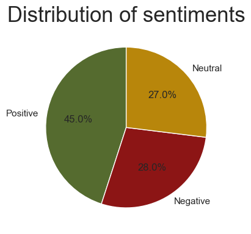
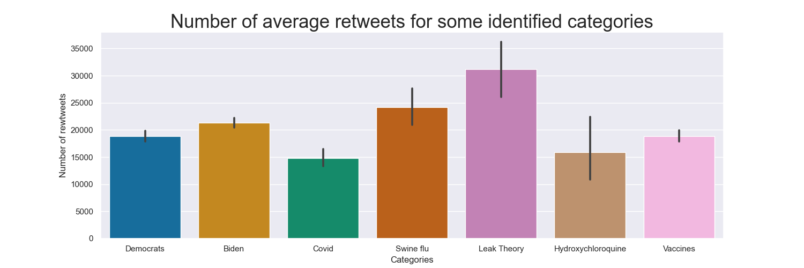

    

# Context

Remember the beginning of 2020, Covid spread like an unprecedent wildfire. The disease was unkwnon, not understood
and scary. Most of the countries decided to lockdown to stop the spread and protect their populations. This resulted in
major and global changepoints in mobility measured by Apple and Google's mobility data :

    

We can spot two distinct patterns here, distinguishing between weekdays and weekends.
On weekdays, a majority of businesses either had to close or transition to telecommuting. This impact persisted beyond
the lockdown period, as indicated by the data.
Conversely, weekends also experienced disruption, but this effect diminished to near pre-restriction levels after the
restrictions were lifted.
We are particularly interested in studying this second part, as during the weekend, people were not working and had free
time to engage in various activities.

This time at home was ideal for cooking, watching cat videos (or play with your cats) and spending time on the internet.
Interestingly, the global internet traffic followed the mobility evolutions:

    

Notably, while the time spent at home witnessed a more significant increase on weekdays, the surge in web searches,
estimated by the number of wikipedia searches, was more pronounced during weekends. This is expected, considering that
weekdays were still occupied by telecommuting activities.

A linear regression analysis supports this observation. When regressing the number of web searches against the time
spent at home, the weekends exhibit a substantially higher coefficient of 2.52, in contrast to the coefficient of 0.84
observed during the week. [Not sure of the method here?]

Main area of searched topics has been studied, you can have a look to : .. . But internet traffic during covid time was
not only made of cooking recipes and cats, it also was a proper time for fake news propagation, or as
the [WHO](https://www.who.int/health-topics/infodemic#tab=tab_1) calls it,
an infodemic. The ancestor of X, Twitter was one of the biggest place to propagate information, especially when
everything was changing as fast as the premise of the covid crisis. We all know that not all people have the same voice
on Twitter, few of them are considered to be the most influential individuals on the network. If you had to bet on of
person to be influential on Twitter, who would it be?

**Take a few seconds and answer to yourself, who would it be?**

I don't know who you got in mind, but for us, it has to be Donald Trump. Before he was evicted from the network (Jan, 9
2021), he was
one of the most followed account (81 millions followers in 2020). If you don't remind his tweet's style, here is a
refresher :

    

We all know Donald Trump has spread fake news, especially on Twitter, his favorite communication channel. His tweets
during the Covid pandemic spread like wildfire, probably making him one of the most influential figures during the
pandemic – but in the end, was he that influential? Will causal analyses of the effect of Trump’s tweets on Wikipedia
and Google Trends pageviews show that he was leading or following online trends? Our goal is to study the impact an
influential leader can have on information spread in a crisis with a focus on fake news, as an overload of misleading or
contradictory statements are known to have a detrimental impact on crisis management.

### Anatomy of "The Donald" Twitter Account

Now we want to know a little bit better our main character of this datastory. For this purpose we will analyze his
tweets. One could argue that it is impossible to understand a person just looking at what he tweeted, the sample is just
too small. Well, this is certainly not the case!

    

As you can see it seems that Trump is always tweeting!
The numbers are just too good to be true. In the period we are considering, which is the entire 2020, he
tweeted/retweeted every day, with a mean of more than 33 tweets per day and peaks of as much as 150 tweets/retweets in
one single day. Considering a day consisting in 16 hours of wake time, on average he posted one tweet/retweet every half
an hour every day for an entire year. The good news are not even finished, he is not just speaking on his own, but he
reaches millions of people. This is testimonied by the millions of likes (almost 2 millions a day on average) and
thousands of retweets (more than 600 hundred thousands a day on average).

Now we know that there is a lot to work on, we want to understand the character. In order to know him
better we want to see what is most interested about. We extrapolated this information visualizing his most used words.

    

We can see that most of his favorites words are related to his continuous political campaign. We notice the words "
vote", "election", "WhiteHouse", but also many regarding his opponent Joe Biden and his political faction of the
democrats. You can also see his favourite disrespectful nickname given to Biden of "Sleepy Joe".
It is clear how you can understand a lot of a person just looking at his tweets if he tweets 30 times a day!
In fact, if you look closely also much more interesting words like "Coronavirus", "China" and "Fake News" appear.
Let's filter the tweets using some keywords related to covid to see if something interesting appears.

    

With no surprise the "hottest" period for covid-related tweets is the one at the start of the pandemic in March. Not
only that was the period in which Trump tweeted the most about covid, but it was also the period in which his covid
related tweets had most success in his public, being the most retweeted ones. But how his interests shifted in the covid
related tweets?

    

Of course filtering with covid as a keyword, it will become the most searched one. But some interesting words like "
swine flu" and "china virus" start popping up, and "fake news" becomes much more important. We thought that this
shifting in the topics was also due to the propensity of Trump on reporting news from non-relying sources, like te ones
that believed that the virus was due to a bad management during the Obama's mandate of the swine flu. This was totally
unrelated to the Covid issues and it was used by Trump as a scapegoat for is poor management of the pandemic.

We asked ourselves if using a Latent Dirichlet Allocation we would be able to isolate a cluster of tweets with these
interesting topics without having to manually select the fake-news related. We chose as reference period the one from
early March to late May, since we saw that was the most interesting one when talking about covid.



Playing around a little bit with the graphical interface we see that the algorithm selects this three main topic
clusters:

    

Given the non-informative nature of these clusters we draw the conclusion that there is a tendency in Donald Trump
tweets to be mainly related to his political campaign also in covid. Huge part of his political campaign is centered in
talking about the other political faction rather than the urgent problems of the nation. For this reason an automatic
algorithm does not fit very well the purpose of identifying tweets related to fake news and we selected them manually.

## Trump the Trend Maker or Trump the Follower, that is the Question! Let's study his favorite fake news

Next, let's dive into the meat of our problem, with one of our main research questions: is there a causal relationship between Trump's tweets and the number
of visits on some Covid-related topics, e.g. hydroxychloroquine on Wikipedia? During the COVID-19 period, Trump claimed that hydroxychloroquine was a cure for COVID-19. 
This claim was not supported by scientific evidence, however, making it more of a fake news really. 
This was further motivation to investigate this topic in particular: Trump, an actor of the infodemic or not? Let's find out!

### Evolution of Online Trends and Trump's Tweeting: a first Graphical Inspection

To answer our question, let's start by graphically studying the evolution of the number of queries/visits on the topic of hydroxychloroquine to assess whether
Trump's tweets had an impact on them.

    

As we can see from the graph above, Trump's tweets on hydroxychloroquine seem to precede certain attention
peaks (e.g. the second big peak at the start of April), but come after others (e.g. the first big peak, around
mid-March). But then, do tweets cause views or the other way around?

### Granger causality - Do Trump's Tweets give useful Information for Predicting Online Interest?

Clearly, a visual inspection of the evolution of tweeting and daily Wikipedia views makes it difficult to assess whether Trump causes tweets or the other way around.
To further investigate the causal relationship between tweeting and online public interest, we therefore chose to conduct
a [Granger causality](https://en.wikipedia.org/wiki/Granger_causality) test. "The Granger causality test is a statistical hypothesis test for 
determining whether one time series is useful in forecasting another". The [null hypothesis](https://www.statsmodels.org/dev/generated/statsmodels.tsa.stattools.grangercausalitytests.html)
is that "the the time series the first column is NOT Granger caused by the time series in the other columns".

We conducted two Granger causality tests: "Trump's Granger causes views on Wikipedia" and "Views on Wikipedia Granger
cause Trump's tweets". 
Both Granger causality tests have at least one [lagged value]([Wikipedia](https://en.wikipedia.org/wiki/Granger_causality)) 
for which the p-value is below the threshold of 0.05. Both tests are therefore statistically signifcant: Trump's tweets Granger cause 
Wikipedia views and vice versa.

How to interpret the fact that the two time series Granger cause each other? As mentioned earlier, Granger causality
just means that one time series is useful at predicting the other. It doesn't necessarily imply real causality.
 There can therefore be two explanations to our results:
 
- sometimes Trump causes tweets, other times public interest causes Trump to tweet;
- or both time series are actually caused by external factors. Sometimes Trump's reacts faster, and sometimes the public
  get interested first. The varying reaction times could explain the Granger causality results.

### Causal Impact - A tool to assess the Impact of one of Trump's Tweets on Online Trends

To further investigate whether Trump's tweets cause views, we will focus on his first tweet, which coincides with a big
peak in interest (both on Wikipedia and Google).
The [Causal Impact](https://google.github.io/CausalImpact/CausalImpact.html) library in Python allows us perform a test
to study the causal effect of Trump's first tweet on the number of Google queries on hydroxychloroquine.
We are focusing on Google Trends queries, as they allows us to study time series at hourly granularity, unlike Wikipedia.
To run this analysis we need the following variables:

- y: the number of visits to the the page of hydroxychloroquine (test variable).
- x: the number of visits to a set of pages (the control variables), which were not affected by the intervention (
  Trump's first tweet).

For the control variables, we picked the time series of the following five topics, which for obvious reasons should not have been affected
by Trump's tweet: climate, coffee, news, shop and time. 

A causal impact analysis for this first tweet corroborates the visual inspection of the Wikipedia time series: the
peak in interest on hydroxychloroquine preceded Trump's first tweet. His tweet therefore didn't seem to have had a strong impact
on interest. Note, however, that we used global trends time series. It might be that Trump had a local impact (though probably not
strong) on Google searches, e.g. in the United States.

As explained earlier, an alternative possibility to explain why online trends time series and Trump's tweets Granger
cause each other is that an external factor is the "real" cause of the surge of interest.

Some online research revealed that the big peak in interest mid-March might have caused by the two following major
events, which both took place on March 16, 2020:

- A mobility changepoint in the United States following restrictions, according
  to [Manoel et al.](https://arxiv.org/abs/2005.08505),
- "A study on the use of hydroxychloroquine in patients with SARS-CoV-2 was published (online via Youtube) - The
  preliminary data from
  this small study was heard round the world", as quoted
  from [Saag et al.](https://jamanetwork.com/journals/jama/fullarticle/2772921).

We therefore tried to reconduct a causal impact analysis, considering March 16, 5 P.M. (GMT, so between 9 A.M and 12
A.M. in the USA) as our intervention time. The resulting plot can be seen in the following Figure.

    

The causal impact analysis shows that the intervention on March 16 (the mobility restrictions, the publication or both -
perhaps even other events: this period was quite hectic) had a strong impact on Google Trends searches.

In conclusion, Trump's tweets and online Trends are correlated, and both time series contain information that can
predict the other (cf. Granger causality). A focus on the first tweet suggests that rather than the tweets causing public online interest
or vice versa, it is quite likely that external events were the real cause of interest. This closer analysis was only conducted on one
of his tweets and for one topic, however. The results should therefore be interpreted with caution, and a more systematic study should
be done to generalize our observations.

## Is Trump's tweets influence predictable?

So far we demonstrated the difficulty to assess causal links between Trump's tweets and general online trends and
viceversa. We want now to
investigate if the number of retweets the sentiment of Trump's tweets and can be predicted according to two exogenous
factors that
we think are
relevant. We will study the topics and sentiment of his tweets with a primary focus on they sentiments. Further, we will
try to see if we can predict the tweets' sentiments from some outside signals.

### Sentiment analysis of Trump's tweets

    

To comprehend the general sentiment within Trump's tweets, we utilized VADER, a rule-based sentiment analyzer specific
for social media text. Each tweet is assigned a score calculated as the aggregate of individual word scores within the
text. Our analysis will focus on compound score, which is a combination of positive, negative, and neutral scores.

Our findings indicate a predominately positive sentiment in Trump's tweets. This observation could have two
potential explanations:

- As a politician, Trump might be inclined to emphasize positive events over negative ones in his tweets. Highlighting
  favorable occurrences concerning himself or his voters could serve as a making a case for voting himself, such as :

"The 75,000,000 great American Patriots who voted for me, AMERICA FIRST, and MAKE AMERICA GREAT AGAIN, will have a GIANT VOICE long into the future. They will not be disrespected or treated unfairly in any way, shape or form!!!"
 

- The VADER lexicon might be inaccurate capturing the sentiment the sarcastic tweets. Despite VADER's focus on social
  media language, discerning sarcasm remains a challenging task, potentially introducing biases in the analysis. As an
  example, the following tweet is considered positive by VADER:

"mike pence didn’t have the courage to do what should have been done to protect our country and our constitution  giving states a chance to certify a corrected set of facts  not the fraudulent or inaccurate ones which they were asked to previously certify  usa demands the truth" 
 

Our strategy to assess VADER's capability to interpret Trump's sentiment consists on focusing on tweets related to other
topics, for example Joe Biden and Democrats. We expect a negative sentiment given that they are the main target of
Trump's tweets. Yet,
upon observing the plotted data, while a slight shift in sentiment distribution is evident, the dominant sentiment
remains neutral or positive. We should be careful further proceeding in our analysis since sarcasm could alter our
results.
Interestingly, looking at the graph below, only tweets associated with fake news in relation to COVID-19 exhibit a
notably strong negative sentiment. This aligns with expectations since Trump's tweets concerning fake news usually serve
as attacks directed at Democrats, the establishment, and the media.

    

### What makes Donald Trump retweeted?

We have seen than Donald Trump is usually not a trendmaker, but more of a trendfollower. Still, he propagates the trend.
Let's use the number of retweets of his declarations to spot what type of tweets are more influencial and spread. We
already noticed that Trump's tweet are compound in sentiments. Let's see what sentiments spread the most:

    

According to this, negative sentiment tends to be significantly more retweeted. As shown in part 2, those tweets might
refer to democrats or others of his ennemies. We can dive into different topics categories, the following
plots shows the average number of retweets for some broad categories we identified:

    

Surprisingly, talking about Covid makes fewer retweets than his usual subjects such as democrats and Joe Biden. However,
when we identify a topic associated to known fake news in the tweet, this is related to more retweets in average
Nonetheless, note that since the distribution of sentiment is different across categories, visuallynassessing the impact
of each
of them separately is delicate. And we can check the significance of the difference of average retweets by looking at
retweets for each category separately :

    

Looking at this, we wondered, can we predict the impact of Trump's tweet focusing on our main interests : being Covid
related, fake news related and adding the tweet's sentiment ? Moreover, can we disentangle the impact of topics and
sentiments on the number of retweets?
When regressing number retweets versus sentiment types, being fake news related (talking about one the
fake news topics we studied) and being related to covid, we obtain:

Here, intercept corresponds to the zero class, being not fake news related, not covid-related and neutral.

|                  |       Coef       | Std error | 
|:-----------------|:----------------:|:---------:|
| Intercept        | 2.098e+04 (***)  |  295.588  |
 C(covid_related) | -4894.4386 (***) |  736.312  | 
| C(is_fake_news)  | 7912.5949 (***)  | 1933.190  
| C(NEGATIVE)      | 2782.3507 (***)  |  417.806  |
| C(POSITIVE)      |     109.9182     |  376.424  |
| R^2              |      0.009       |           |

*p-values* : ***p<0.001, **p<0.01 and  *p<0.05

From this, we can conclude that :

- Talking about covid is significantly reducing the number of potential retweets
- However, a tweets related to fake news will significantly increase the number of potentiel retweets, higher than the
  decrease when talking about covid
- Negative sentiment in tweets spread significantly more than neutral ones
- However, we can not say that positive ones spread either faster either slower than neutral ones

While not allowing a complete conclusion, these results support two classic opinions about information spread on social
media:

- Tweets with identified negative sentiment spread more than those with positive/neutral ones, which seems opposite to
  the New York Times
  conclusion : [Good News Beats Bad on Social Networks](https://www.nytimes.com/2013/03/19/science/good-news-spreads-faster-on-twitter-and-facebook.html)
- Talking about fake news tends to create more impact than truth, consistent with the
  study: [On Twitter, false news travels faster than true stories](https://news.mit.edu/2018/study-twitter-false-news-travels-faster-true-stories-0308)

### Logistic regression on Trump's sentiment

Now that we identified that some components of Trump's tweet have a direct impact of their spread, we would like to
predict those components by focusing on the tweets' sentiment. As predictors of Trump's tweets sentiment we use the mean
of compounded score of daily american tweets, and the rise in
new COVID-19 cases in US. Our focus was on a specific timeframe spanning from March 19, 2020 to April 18, 2020.

Initially, we conducted separate regressions, regressing Trump's sentiment on each predictor individually. Both
predictors exhibited significance at a 5% level. Subsequently, taking a step forward, we incorporated both predictors
into the regression model. Notably, we retained the expected sign of the coefficients, and the p-values reduced compared
to the single-predictor regressions.

Below, we present the regression results in the following table.

#### Logistic regression (Trump's sentiment ~ general sentiment + increment of new cases)

=\beta_0&plus;\beta_1&space;x_{general-sentiment}&plus;\beta_2x_{increment-of-new-cases})

|                    |    Coef     | Std error | 
|:-------------------|:-----------:|:---------:|
| Intercept          |   -1.2070   |   0.679   |
 people_sent        | 4.8260 (*)  |   2.069   | 
| increase_new_cases | -1.9933 (*) |   0.875   
| R^2                |      ?      |           |

*p-values* : ***p<0.001, **p<0.01 and  *p<0.05

We now want to assess the robustness of our logistic regression, we compute the confusion Matrix, the ROC curve and the
AUC score. a.

    

The results obtained are promising, demonstrating both precision and recall values at 0.8. Our analysis was conducted
within a month-long window, aligning with the peak period of interest in Trump's tweets about Covid-19.
The regression analysis used aggregated daily data, providing a more stable viewpoint compared to the volatility
inherent in individual tweets. However, extending this analysis over a more extended period might not work. As time
progresses, Trump's interest in Covid topic decline, resulting in a scarcity of daily data.

Moreover, this logistic regression demonstrated that Trump's tweets sentiments, which have a key impact of their
influence can be predicted from exogenous factors. This support the conclusion that Trump is not making trend but follow
the crowd and its sentiment.

# Conclusion:
This project studied the impact of Donald Trump's tweet during the covid epidemic. This was a time of intense internet
traffic in which Trump was a very specific tweeting character. Our main research interest was its impact on the spread
of fakenews. Especially, was Trump a trendmaker or was he only following some hot topics
already present on Twitter? Said differently, was Trump influential enough to start the spread of a fake news? Through
some causal analysis tools, we could demonstrate no precursor effect of Trump on the online trends of some identified
fake news. When looking at it closely, it seems that exogenous effects ware actually the reason for interest to rise on
a topic, and Trump to tweet on a topic. Following this interest on fake news, we looked to the question the other way
around, what properties of Trump's tweet would make it influential (i.e. being retweeted) and can we predict the
presence of these properties in tweets based on exogenous factors? We first assessed the impact of sentiment on the
number of retweets followed by the impact of some identified topics. We observed a net increase of retweets for negative
tweets compared to neutral and positive ones. We also showed that some topics spread more easily than others.
A regression allowed us to disentangle the impact of each on the number of retweets. Finally, we saw that the sentiment
of a tweet can be fairly well predicted from exogenous data, putting weights on our already sketched conclusion:

**Donald Trump had a sure influence on Twitter, but no demonstration of real trendmaking could have been demonstrated,
he might have been only surfing on the trends for a while**

Finally, recall that our study might be more actual than it looks, since August 24, Donald Trump is back on X (new
Twitter), showing his [mugface](https://twitter.com/donaldtrump) has a return sign. Since he is running for presidency
again, is he using the same communication patterns as we found in our study? While, [The Economist](https://www.economist.com/leaders/2023/11/16/donald-trump-poses-the-biggest-danger-to-the-world-in-2024) advocates that Trump
poses serious threats to the world stability, no one should worry, Trump's promises to be a dictator, [only on day one](https://eu.usatoday.com/story/news/politics/elections/2023/12/11/donald-trump-dictator-one-day-reelected/71880010007/) !  
